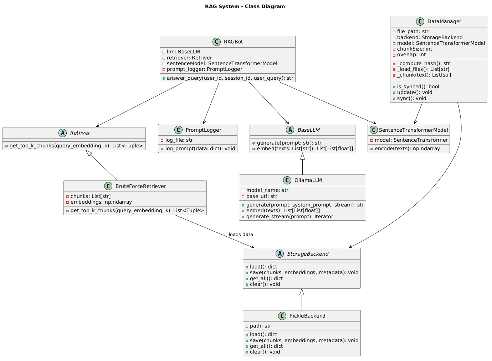
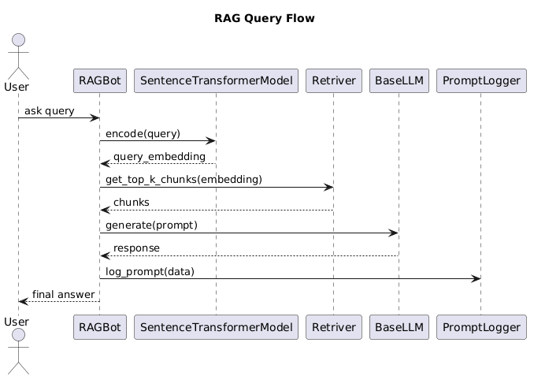

# Steps to Set up the Bot

1. set-up ollama 
2. ollama pull mistral
3. python  -m venv myenv
4. activate the env
5. pip install -r requirements.txt
6. python DataLayer/testData.py -- test DataLayer
7. python LLMLayer/testLLM.py  -- test LLMLayer
8. setx TELEGRAM_BOT_TOKEN "your_actual_token_here"  --(Get this from @botFather on telegram)
9. run main.py
10. Go the telegram bot and ask querry.

# Telegram bot instructions

| Command                 | Description                                                                 |
|------------------------|-----------------------------------------------------------------------------|
| /ask <query>           | Runs the RAG query; shows a warning if no query is provided                |
| /help                  | Displays formatted usage instructions                                      |
| /start                 | Resumes the bot for that chat (sets polling active)                        |
| /quit                  | Pauses the bot for that chat (ignores /ask and free-text)                  |

#  RAG-Based Telegram Bot – System Design

##  Overview

This project implements a **Retrieval-Augmented Generation (RAG)** system integrated with a **Telegram Bot**.

It allows users to:
- Ask questions via Telegram
- Retrieve relevant knowledge from custom data
- Generate intelligent responses using an LLM

---

##  High-Level Architecture
User (Telegram) → Telegram Bot → RAGBot → Retriever → LLM → Response
↓
StorageBackend
↑
DataManager

---

## Query Flow (Runtime)

1. User sends a message or `/ask` command on Telegram
2. Telegram handler receives the message
3. Query is passed to `RAGBot`
4. Query → embedding using `SentenceTransformerModel`
5. Retriever fetches top-k relevant chunks
6. Prompt is constructed using context + query
7. LLM generates response
8. Response is sent back to user
9. Interaction is logged

---

##  Components

### 1. Telegram Layer (Interface Layer)

Handles user interaction via Telegram.

#### Features:
- `/ask <query>` → Query the knowledge base
- `/start` → Activate bot
- `/quit` → Pause bot
- `/help` → Usage instructions
- Free-text support (auto-query)

#### Responsibilities:
- Manage chat state (active/paused)
- Route user input to RAG system
- Send responses back to users

---

### 2. RAGBot (Core Orchestrator)

Handles:
- Query embedding
- Retrieval
- Prompt construction
- LLM response generation
- Logging

---

### 3. DataManager (Data Pipeline)

Responsible for:
- Loading files
- Chunking text
- Generating embeddings
- Syncing with storage using hashing

---

### 4. StorageBackend (Persistence Layer)

Stores:
- Text chunks
- Embeddings
- Metadata

#### Current:
- `PickleBackend`

---

### 5. Retriever (Search Layer)

Finds relevant chunks using similarity search.

#### Current:
- `BruteForceRetriever`

---

### 6. Embedding Model

Converts text → vector

#### Current:
- `SentenceTransformerModel`

---

### 7. LLM Layer

Generates final response

#### Current:
- `OllamaLLM` (local inference)

---

### 8. PromptLogger (Observability)

Logs:
- Queries
- Context
- Responses
- Metadata

---

##  Why This Design is Useful

### ✔ Modular
Each layer is independent:
- Telegram UI can be replaced with Web UI / API
- LLM can be swapped easily
- Retriever can be upgraded

---

### ✔ Scalable
You can scale each layer independently:
- Move storage to cloud
- Replace retriever with vector DB
- Use hosted LLM APIs

---

### ✔ Extensible
Easy to add:
- Multi-user sessions
- Chat history
- Personalization

---

### ✔ Real-world Ready
- Async Telegram handlers
- Logging
- Stateful chat control (pause/resume)

---

# 💡 Use Cases 
- E-commerce assistant
- Customer support bot
- Knowledge base Q&A
- Internal company assistant